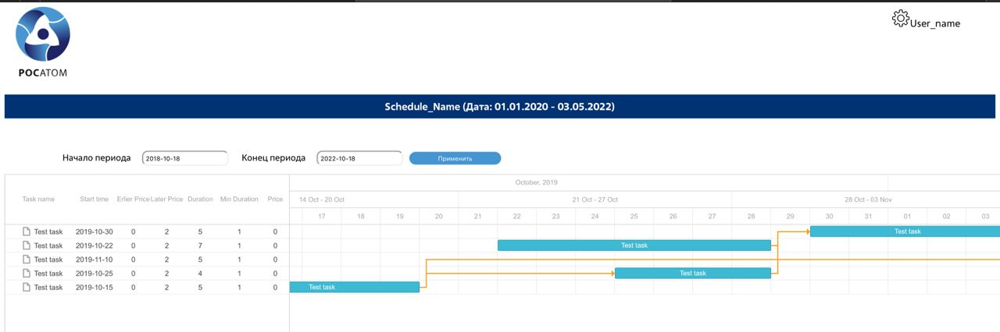

# Kronos - менеджер задач план-графиков работ
## Команда "Боевые котята" для ГК "Росатом" (хакатон Цифровой прорыв)

## О решении задачи

Решение представляет из себя веб-интерфейс отображающий текущий проект с его план-графиками, вехи и запланированный перечень работ. При изменении сроков хотя бы в одних работах сдвигаются и связанные с ними и пользователю предлагается расчет предполагаемых потерь за счет наложения штрафов и оптимизированный план-график работ минимизирующий данные потери за счет уменьшения сроков. 

## Стек
Используемый стек: 

* H2 Database
* Spring Boot
* HTML/CSS
* JavaScript (JQuery/AJAX)

Работа через Spring Data позволяет использовать другие БД, например, PostgreSQL
Решение позволяет управлять проектом с сотнями тысяч работ и оптимизировать потери при сдвиге/срыве сроков.

## Роли участников

**Захаров Илья** - аналитика

**Ладыгина Настя** - фронтэнд, UI/UX

**Тарская Алина** - интеграция frontend и backend, управление данными

**Совков Андрей** - backend, devops
